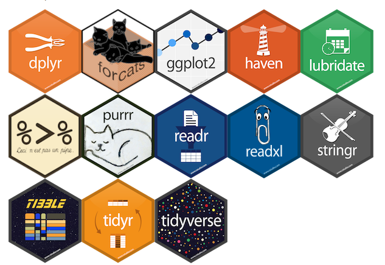
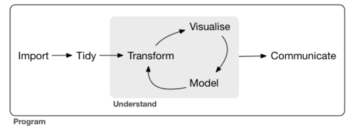
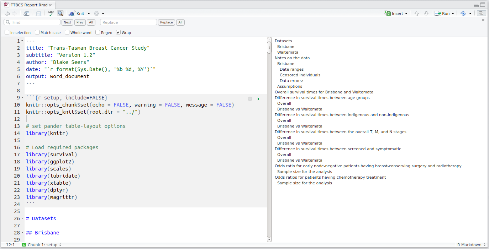

The philosophy of the tidyverse
========================================================
author: 
date: 11 August 2017
autosize: false

What is the tidyverse?
========================================================

The tidyverse is a collection of **R** packages that are all based on one simple,
underlying philosophy to data science:

## Solve a complex problem by **combining simple pieces** that have a **consisitent structure**.

The collection of tidyverse packages:
========================================================

- share the same data representation and programming styles, i.e. API design. 
- work in harmony



The collection of tidyverse packages:
========================================================

These can all be installed and loaded easily in **R**:


```r
install.packages("tidyverse")
library(tidyverse)
```


Remember: These packages work together to solve a complex problem by **combining simple pieces** that have a **consisitent structure**.

But how?

Combining...
========================================================

- With assignment, composition or the pipe (`%>%`) operator
- Function fit best into a pipe when 
    + The first argument is the "data".
    + The data is the same type across different functions.

...Simple pieces...
========================================================

- Functions:
    + do one thing well 
    + can be understood with minimal context.
- Always comment your code:
    + why did you write this piece of code --- not how it works.

...Consistent structure.
========================================================

- Tidy tibbles instead of the conventional `data.frame()`
    + Each dataset goes in a tibble.
    + Each column represents a variable.
    + Each row represents an observation.
- Columns are `list`s that can store richer data structure.

Workflow of a typical data science project
=======================================================

<div align="center">


Data import
=======================================================

- `readr`: for CSV files.
- `haven`: for SPSS, SAS and Stata files.
- `readxl`: for MS Excel files.

Note that character variables in the dataset remain as a character variables. The  `read.csv()` function automatically converts these variables into a factor variable.

Data tidying
=======================================================
- `tidyr`: data tidying 
    + `gather` function: convert the dataset from wide format to long format.
    + `spread` function: convert the dataset from long format to wide format.
-  `tibble`: new type of data frames.

Data transformation 
=======================================================
- `dplyr`: data manipulation


Data visualization
=======================================================
- `ggplot2`

Example
=======================================================

## Trans-Tasman Breast Cancer Study

- Recent client.
- Interested in understanding the differences in breast cancer survival times for patients in Waitemata and Brisbane hospitals.

Example --- Data import
=======================================================


```r
# Read in breast cancer data
ttbcs_tbl = read_csv("CSV/ttbcs.csv")
ttbcs_tbl
```


```
# A tibble: 1,767 x 21
   patient_code birth_date core_biopsy
          <chr>      <chr>       <chr>
 1      B003920 1931-07-08  2013-03-20
 2      B019064 1930-06-03  2011-04-18
 3      B041025 1934-05-16  2013-07-31
 4      B049838 1935-01-08  2011-06-20
 5      B055154 1938-11-23  2008-07-07
 6      B057829 1923-04-19  2009-08-03
 7      B060717 1929-01-29  2008-07-01
 8      B061836 1940-07-24  2009-12-08
 9      B073978 1939-11-10  2010-06-11
10      B089272 1943-09-10  2011-08-08
# ... with 1,757 more rows, and 18 more
#   variables: death_date <dttm>,
#   ethnicity <chr>, censored <int>,
#   dataset <chr>, t_stage <chr>,
#   n_stage <chr>, m_stage <chr>,
#   overall_tmn_stage <chr>,
#   presented <chr>,
#   surgery_type <chr>, size <dbl>,
#   radiation <chr>,
#   chemotherapy <chr>,
#   surv_time <dbl>, age <dbl>,
#   age_group <chr>, indigeneity <chr>,
#   overall_stage <chr>
```

Example --- Data transformation
=======================================================


```r
# Include a variable denoting the survival time
ttbcs_tbl %<>% 
  mutate(surv_time = as.numeric(death_date - core_biopsy) / 30.5)
```

Example --- Visualise
=======================================================

<div align="center">


Example --- Visualise
=======================================================

<div align="center">


Example --- Communicate
=======================================================

R markdown allows for a reproducible report that contains all of your well-organised code so you can easily come back to an old project.

<div align="center">


Example --- Communicate
=======================================================

<div align="center">

